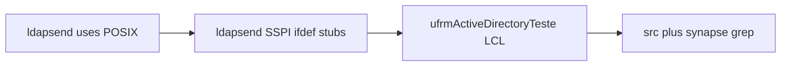

# Plano: compatibilidade Linux (FPC / Lazarus)

## Contexto e decisão

- Objetivo acordado: **compilar e usar LDAP/LDAPS no Linux** (bind simples, StartTLS, operações já portadas ao Synapse), com **GSSAPI / LDAP Signing / CBT via SSPI apenas em Windows** — em POSIX, métodos dependentes de `secur32.dll` viram **stubs** (retorno `False` ou erro explícito), sem integrar MIT/Heimdal nesta fase.
- O raciocínio de [ldapsend.pas](e:\GestorERP\projects\modules\ActiveDirectoryORM\Packege\synapse\ldapsend.pas) (linhas 80–99) resolve só a parte **`uses`**. No Linux, o ficheiro **ainda falha na interface**: tipos e variáveis globais SSPI (`HMODULE`, `TLDAPSecHandle`, ponteiros para `stdcall`, `FLDAPSecur32Lib`, métodos `BindGSSAPI*`, `SignLDAPMessage`, etc.) estão declarados **sem** `{$IFDEF MSWINDOWS}` (ver ~177–616).

## Fase 1 — `ldapsend.pas` (bloqueador principal)

1. **Interface**
   - Envolver em `{$IFDEF MSWINDOWS}`: constantes SSPI-only (ex.: `ISC_REQ_*`, `SECBUFFER_*`, `SEC_E_*` se só usadas no caminho SSPI), tipos `TLDAPSecHandle` / buffers, variável global `FLDAPSecur32Lib` e todos os ponteiros de função `LDAP_*`.
   - Manter tipos LDAP genéricos (`TLDAPSend`, `Search`, `Bind`, etc.) **fora** do ifdef.
   - Declarar métodos públicos `BindGSSAPI`, `BindGSSAPIWithCBT`, e qualquer API que dependa exclusivamente de SSPI **sempre** na classe (assinatura estável), mas na implementação POSIX: corpo stub.

2. **Implementation**
   - `LoadSSPIFunctions`, `SSPICleanup`, `GSSAPIStep`, `BuildCBTData`, `SignLDAPMessage`, `VerifyLDAPMessage`, e corpos de `BindGSSAPI` / `BindGSSAPIWithCBT` (e chamadas a signing no fluxo de bind, se existirem): **só compilam em `MSWINDOWS`**.
   - Em `{$ELSE}` (POSIX): stubs mínimos — por exemplo `BindGSSAPI*` → `Result := False` e `FResultString` / log coerente; `SignLDAPMessage` → devolver mensagem sem assinatura ou `Result` vazio conforme o fluxo atual permitir sem quebrar callers; garantir que **nenhuma** referência a `LoadLibrary('secur32.dll')`, `PWideChar` SSPI, ou `FreeLibrary` fique fora do bloco Windows.

3. **`uses`**
   - Manter o padrão atual: FPC → `SysUtils, Classes, Math` + `Windows` apenas com `MSWINDOWS`; Delphi → `System.*` + `Winapi.Windows` condicional (como no teu snippet).
   - Revalidar que **Linux FPC** não puxa `Windows` na cláusula `uses` quando `MSWINDOWS` está ausente.

4. **Validação**
   - Compilar com `fpc` alvo **Linux x86_64** (ou Lazarus LPI do módulo, se existir) o pacote/unidade que inclui `ldapsend.pas`; corrigir erros remanescentes (ex.: `System.Delete` qualificado — já existe padrão CIL no ficheiro; se FPC reclamar, trocar para `Delete` não qualificado só dentro de `{$IFDEF FPC}`).

## Fase 2 — Views (VCL → LCL no FPC)

- **[ufrmActiveDirectoryTeste.pas](e:\GestorERP\projects\modules\ActiveDirectoryORM\src\Views\ufrmActiveDirectoryTeste.pas)** está só com `Winapi.*` + `Vcl.*` (linhas 29–31), ao contrário de **[ufrmLDAP_Teste.pas](e:\GestorERP\projects\modules\ActiveDirectoryORM\src\Views\ufrmLDAP_Teste.pas)** que já tem `{$IFDEF FPC}` com `LCLType`, `LCLIntf`, `Forms`, etc.
- Replicar o **mesmo esqueleto** de `ufrmLDAP_Teste.pas`: blocos `{$IFDEF FPC} ... {$ELSE} ... {$ENDIF}` em `uses`, e ajustes pontuais de API (mensagens, `Application.`, handlers) só onde o compilador LCL exigir.
- Ignorar ou alinhar **[__recovery/ufrmActiveDirectoryTeste.pas](e:\GestorERP\projects\modules\ActiveDirectoryORM\src\Views\__recovery\ufrmActiveDirectoryTeste.pas)** conforme política do repo (geralmente não participar do build — confirmar no `.lpi`/`.lpr`).

## Fase 3 — Varredura Synapse (`Packege/synapse`)

- Inventário automático: procurar `Winapi.`, `System.SysUtils`, `System.Classes` em `*.pas` do Synapse.
- **Prioridade**: unidades que o ActiveDirectoryORM **liga de facto** ([blcksock.pas](e:\GestorERP\projects\modules\ActiveDirectoryORM\Packege\synapse\blcksock.pas), [synautil.pas](e:\GestorERP\projects\modules\ActiveDirectoryORM\Packege\synapse\synautil.pas), [asn1util.pas](e:\GestorERP\projects\modules\ActiveDirectoryORM\Packege\synapse\asn1util.pas), [ssl_openssl*.pas](e:\GestorERP\projects\modules\ActiveDirectoryORM\Packege\synapse), [ldapsend.pas](e:\GestorERP\projects\modules\ActiveDirectoryORM\Packege\synapse\ldapsend.pas)).
- Onde já existir padrão bom (ex.: comentário e `{$IFDEF MSWINDOWS}Winapi.Windows` em [ssl_openssl_paths.pas](e:\GestorERP\projects\modules\ActiveDirectoryORM\Packege\synapse\ssl_openssl_paths.pas)), **não duplicar trabalho**; só harmonizar ficheiros que ainda forcem RTL Delphi sem ramo FPC.

## Fase 4 — `src/` (núcleo ORM)

- A maior parte das units já usa `{$IFDEF FPC}` (ex.: [ActiveDirectory.Service.pas](e:\GestorERP\projects\modules\ActiveDirectoryORM\src\ActiveDirectory.Service.pas) com `fpjson` vs `System.JSON`).
- Após Fases 1–2, grep final em `src/**/*.pas` por `Winapi.` e `System.` sem ifdef adjacente; corrigir só o que o **build Linux** acusar (evitar refactor cosmético).

## Riscos e critérios de aceite

- **Risco**: callers em [ActiveDirectory.Service.pas](e:\GestorERP\projects\modules\ActiveDirectoryORM\src\ActiveDirectory.Service.pas) que chamem `BindGSSAPI*` ou signing no Linux — devem continuar a compilar e falhar de forma **previsível** em runtime (documentar na unit ou num comentário de cabeçalho do serviço).
- **Aceite**: projeto compila no alvo **Linux** com FPC/Lazarus; teste manual: bind simples + search num AD acessível por rede (cenário típico); chamadas GSSAPI no Linux retornam erro controlado, sem crash.

## Ordem sugerida de execução

