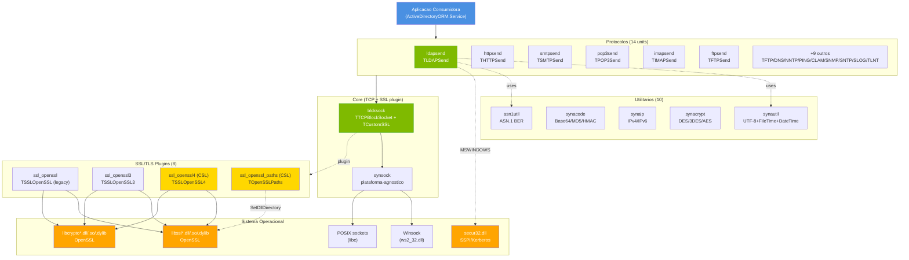
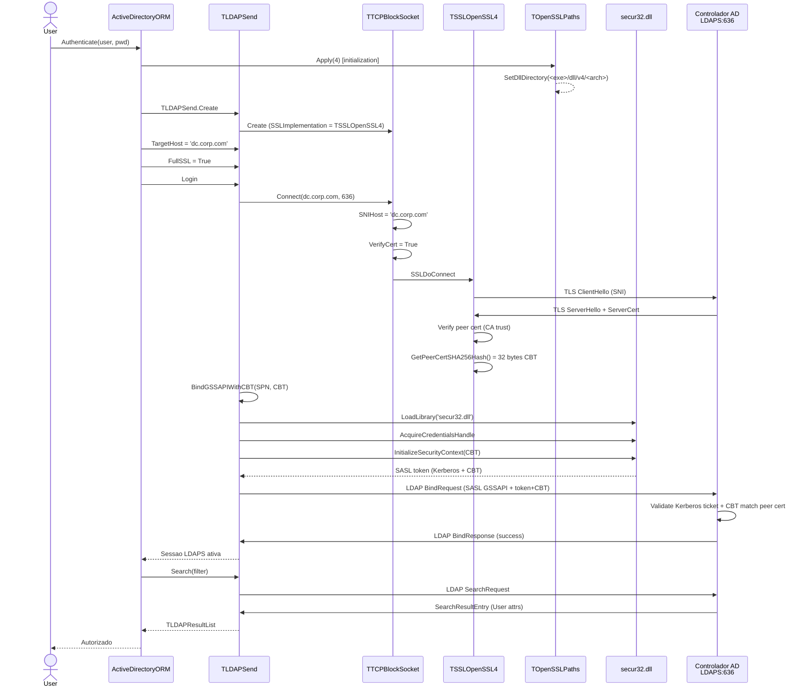
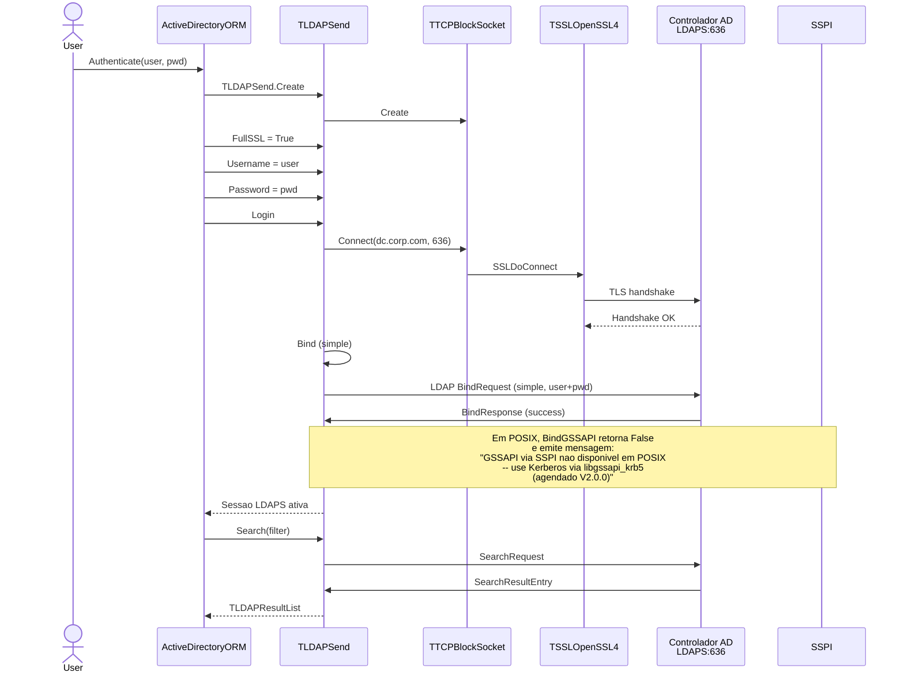
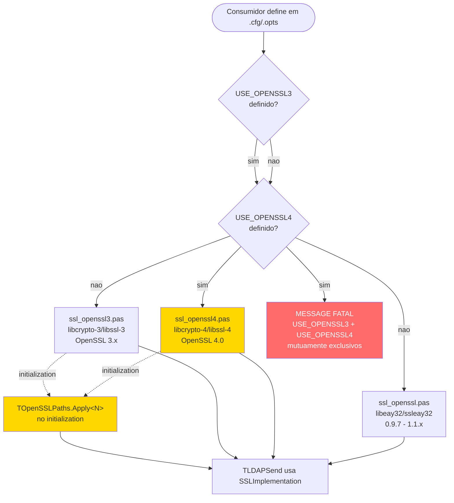
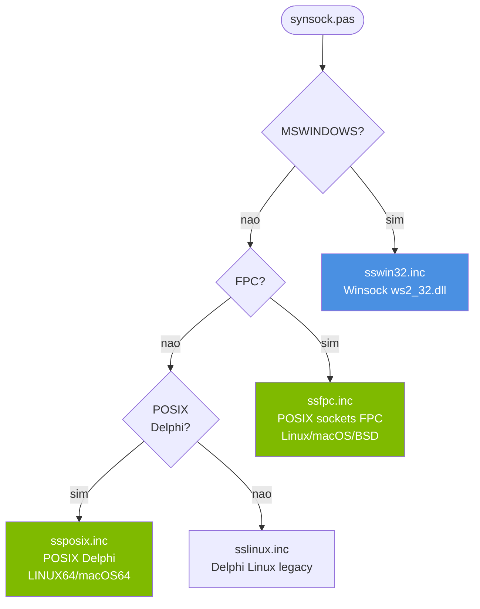
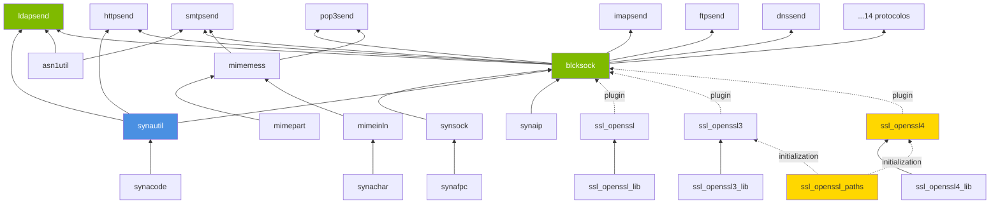
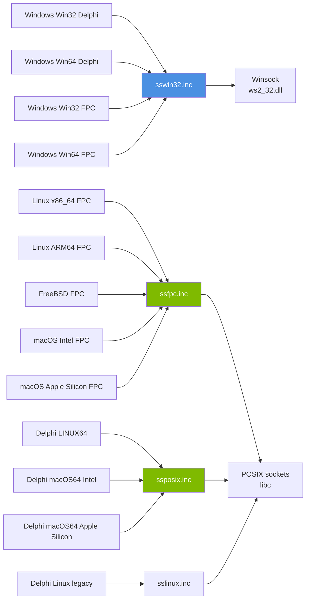
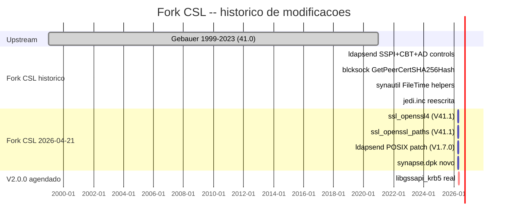

# FLOWCHART — Synapse CSL fork V41.3

Diagramas Mermaid da arquitectura, heranca, dependencias e fluxos de execucao do package `Packege/synapse/`.

**V1.7.1 (2026-04-22):** adicionados `TLDAPValueType` (enum) e `TLDAPAttributeValue` (record acessor estilo TField) no diagrama de heranca — ver seccao "Heranca / Composicao" abaixo.

**V1.7.2 (2026-04-22):** `TLDAPSend.Search` e `TLDAPSend.DoSearchAD` passam a invocar `TLDAPAttribute.AddRaw` em vez de `Add` no parser ASN.1 interno (callsites ~2157 e ~2330). Os fluxos de Search mostrados a seguir assumem este caminho — bytes ASN.1 fluem do socket directamente para `FRawValues` sem passar por `UnquoteStr` nem conversao implicita `AnsiString -> UnicodeString`.

---

## 1. Arquitectura de alto nivel



**Legenda:** Verde = Core CSL fork · Amarelo-ouro = Units novas CSL 2026-04-21 · Laranja = DLLs externas dynload · Azul = Aplicacao consumidora.

---

## 2. Hierarquia de heranca (classes)

```mermaid
classDiagram
    TObject <|-- TSynaClient
    TSynaClient <|-- TLDAPSend
    TSynaClient <|-- THTTPSend
    TSynaClient <|-- TSMTPSend
    TSynaClient <|-- TPOP3Send
    TSynaClient <|-- TIMAPSend
    TSynaClient <|-- TFTPSend
    TSynaClient <|-- TDNSSend
    TSynaClient <|-- TPINGSend
    TSynaClient <|-- TSNMPSend
    TSynaClient <|-- TSNTPSend
    TSynaClient <|-- TSyslogSend
    TSynaClient <|-- TTelnetSend
    TSynaClient <|-- TNNTPSend
    TSynaClient <|-- TClamSend
    TSynaClient <|-- TTFTPSend

    TObject <|-- TBlockSocket
    TBlockSocket <|-- TSocksBlockSocket
    TSocksBlockSocket <|-- TTCPBlockSocket
    TSocksBlockSocket <|-- TDgramBlockSocket
    TDgramBlockSocket <|-- TUDPBlockSocket
    TDgramBlockSocket <|-- TICMPBlockSocket
    TBlockSocket <|-- TRAWBlockSocket
    TBlockSocket <|-- TPGMMessageBlockSocket
    TBlockSocket <|-- TPGMStreamBlockSocket

    TObject <|-- TCustomSSL
    TCustomSSL <|-- TSSLNone
    TCustomSSL <|-- TSSLOpenSSL
    TSSLOpenSSL <|-- TSSLOpenSSLCapi
    TCustomSSL <|-- TSSLOpenSSL3
    TCustomSSL <|-- TSSLOpenSSL4
    TCustomSSL <|-- TSSLOpenSSL11
    TCustomSSL <|-- TSSLCryptLib
    TCustomSSL <|-- TSSLLibSSH2
    TCustomSSL <|-- TSSLSBB
    TCustomSSL <|-- TSSLStreamSec

    TStringList <|-- TLDAPAttribute
    TObject <|-- TLDAPAttributeList
    TObject <|-- TLDAPResult
    TObject <|-- TLDAPResultList

    %% V1.7.1 — tipagem automatica de atributos (records/enums sem heranca)
    class TLDAPValueType {
      <<enum>>
      vtUnknown
      vtDirectoryString
      vtIA5String
      vtInteger
      vtBoolean
      vtOctetString
      vtGeneralizedTime
      vtUTCTime
      vtDN
      vtOID
      vtSID
      vtGUID
      vtBitString
      vtNumericString
      vtEnhancedGuide
      vtFileTime
    }
    class TLDAPAttributeValue {
      <<record>>
      +IsNull()
      +AsString()
      +AsInteger()
      +AsFloat()
      +AsBoolean()
      +AsDateTime()
      +AsBinary()
      +AsHex()
      +AsSid()
      +AsGuid()
      +AsVariant()
      +Raw
      +ValueType
    }
    TLDAPAttribute ..> TLDAPValueType : ValueType
    TLDAPAttribute ..> TLDAPAttributeValue : Value / Values[]

    TObject <|-- TMimePart
    TObject <|-- TMimeMess
    TObject <|-- TMessHeader

    TObject <|-- TSynaBlockCipher
    TSynaBlockCipher <|-- TSynaCustomDes
    TSynaCustomDes <|-- TSynaDes
    TSynaCustomDes <|-- TSyna3Des
    TSynaBlockCipher <|-- TSynaAes

    class TLDAPSend {
      +Login()
      +Bind()
      +BindGSSAPI()
      +BindGSSAPIWithCBT()
      +Search()
      +SearchDirSync()
      +Modify()
      +Add()
      +Delete()
    }

    class TTCPBlockSocket {
      +Connect()
      +SSLDoConnect()
      +GetPeerCertSHA256Hash()
    }

    class TSSLOpenSSL4 {
      +Connect()
      +GetPeerCertSHA256Hash()
    }

    class TOpenSSLPaths {
      +Apply(N)
      +Resolve()
      +SetCustomPath()
    }
```



---

## 3. Fluxo LDAPS com GSSAPI + Channel Binding Token (Windows)



---

## 4. Fluxo LDAP simple bind (POSIX — sem GSSAPI real ate V2.0.0)



---

## 5. Fluxo de decisao SSL plugin (compile-time)



---

## 6. Fluxo de directivas de plataforma (synsock)



---

## 7. Fluxo de SSPI/GSSAPI em `ldapsend.pas` (V1.7.0 guardado)

```mermaid
flowchart TD
    Start([uses ldapsend])
    W{MSWINDOWS?}

    SSPI[Bloco SSPI real<br/>6 blocos envolvidos<br/>B1: consts ISC_REQ_*/SECBUFFER_*/SEC_E_*<br/>B2: types TLDAPSecHandle/TLDAPSecBuffer<br/>B3: private fields FSSPICred/FSSPICtx<br/>B4: private methods<br/>B5: global var FLDAPSecur32Lib + 7 funcs<br/>B6: implementacoes]

    Stubs[4 stubs POSIX<br/>BindGSSAPI: False<br/>BindGSSAPIWithCBT: False<br/>SignLDAPMessage: no-op<br/>VerifyLDAPMessage: True]

    MsgV20[FResultString:<br/>'GSSAPI via SSPI nao disponivel<br/>em POSIX -- use Kerberos via<br/>libgssapi_krb5 (agendado V2.0.0)']

    Start --> W
    W -- sim --> SSPI
    W -- nao --> Stubs
    Stubs --> MsgV20

    style SSPI fill:#4A90E2,color:#fff
    style Stubs fill:#FFA500,color:#fff
    style MsgV20 fill:#FFD700,color:#333
```

---

## 8. Dependencias entre units Synapse



---

## 9. Matriz plataforma x chain de includes



---

## 10. Estado do fork CSL (camadas cumulativas)



---

## 11. Mapa de acronimos

| Sigla | Significado |
|---|---|
| **CBT** | Channel Binding Token (RFC 5929 — ligacao LDAP a certificado TLS) |
| **SPN** | Service Principal Name (formato `ldap/dc.corp.com`) |
| **SSPI** | Security Support Provider Interface (API Microsoft em `secur32.dll`) |
| **GSSAPI** | Generic Security Services API (padrao RFC 2743 — Kerberos em POSIX) |
| **SASL** | Simple Authentication and Security Layer (RFC 4422) |
| **LDAP** | Lightweight Directory Access Protocol (RFC 4511) |
| **LDAPS** | LDAP over TLS (porta 636) |
| **SDFlags** | Security Descriptor Flags (controle AD OWNER/GROUP/DACL/SACL) |
| **DirSync** | Directory Synchronization (controle AD para replicacao incremental) |
| **mTLS** | mutual TLS (autenticacao cliente + servidor via certificados) |
| **SNI** | Server Name Indication (extensao TLS RFC 6066) |
| **PDU** | Protocol Data Unit (unidade de dados do protocolo LDAP) |
| **UAC** | User Account Control (atributo AD `userAccountControl`) |

---

**Gerado:** 2026-04-21 (DocAgent reverse-engineering V2)
**Revisao:** CSL fork V41.3 / ADORM V1.7.2
**Source files analisados:** 50 `.pas` + 8 `.inc` + 2 packages (.lpk + .dpk)
