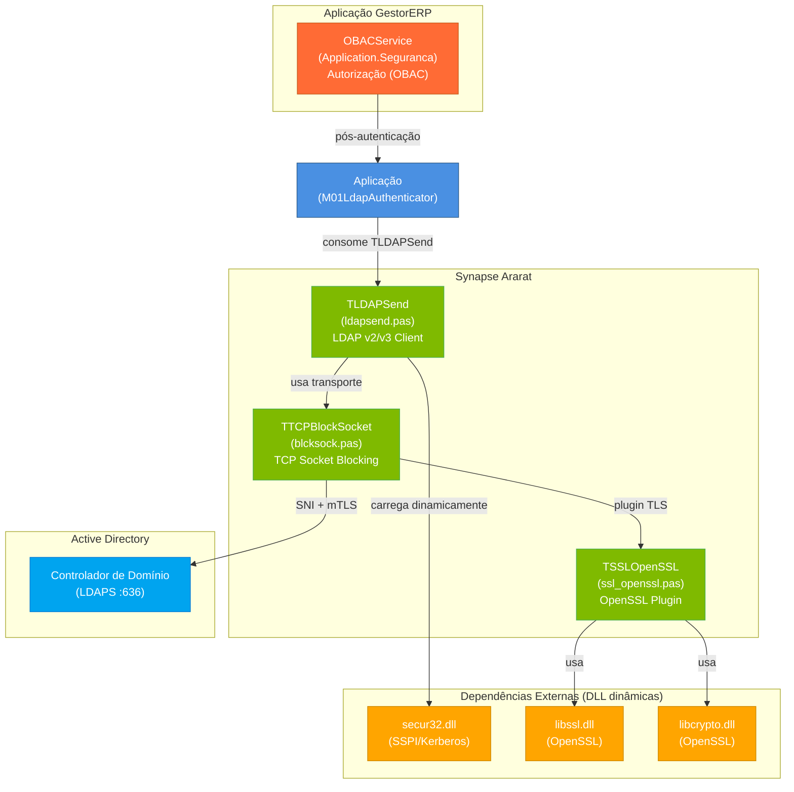
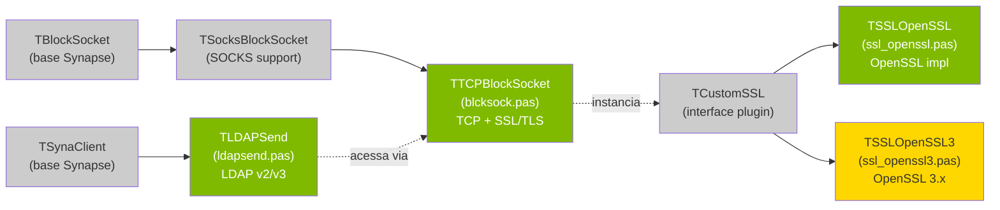
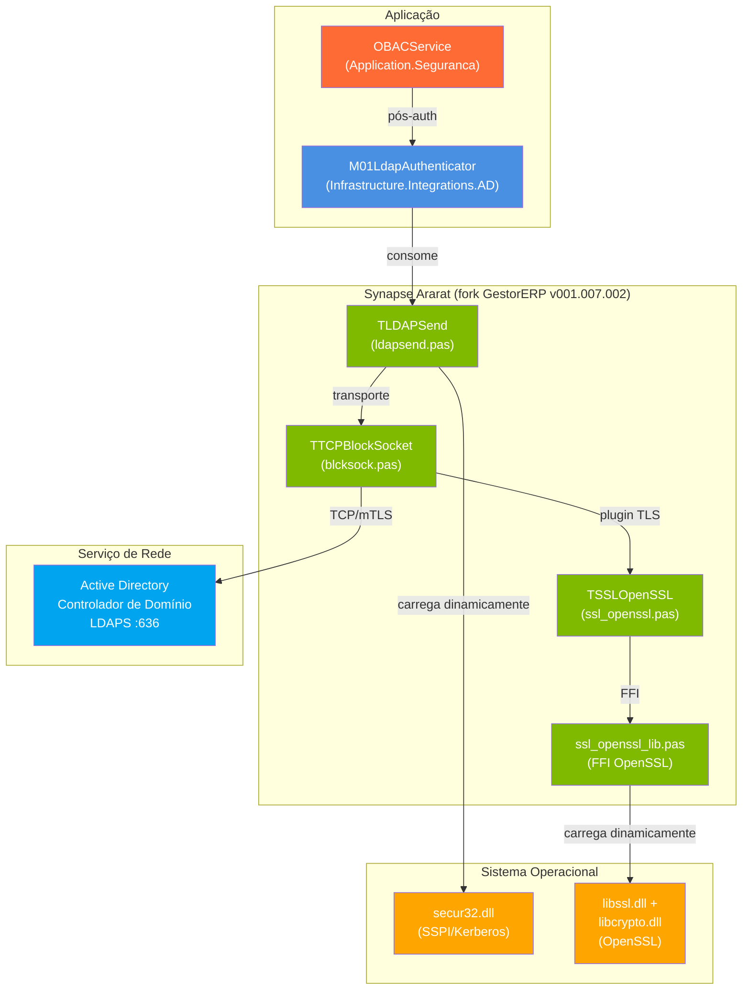
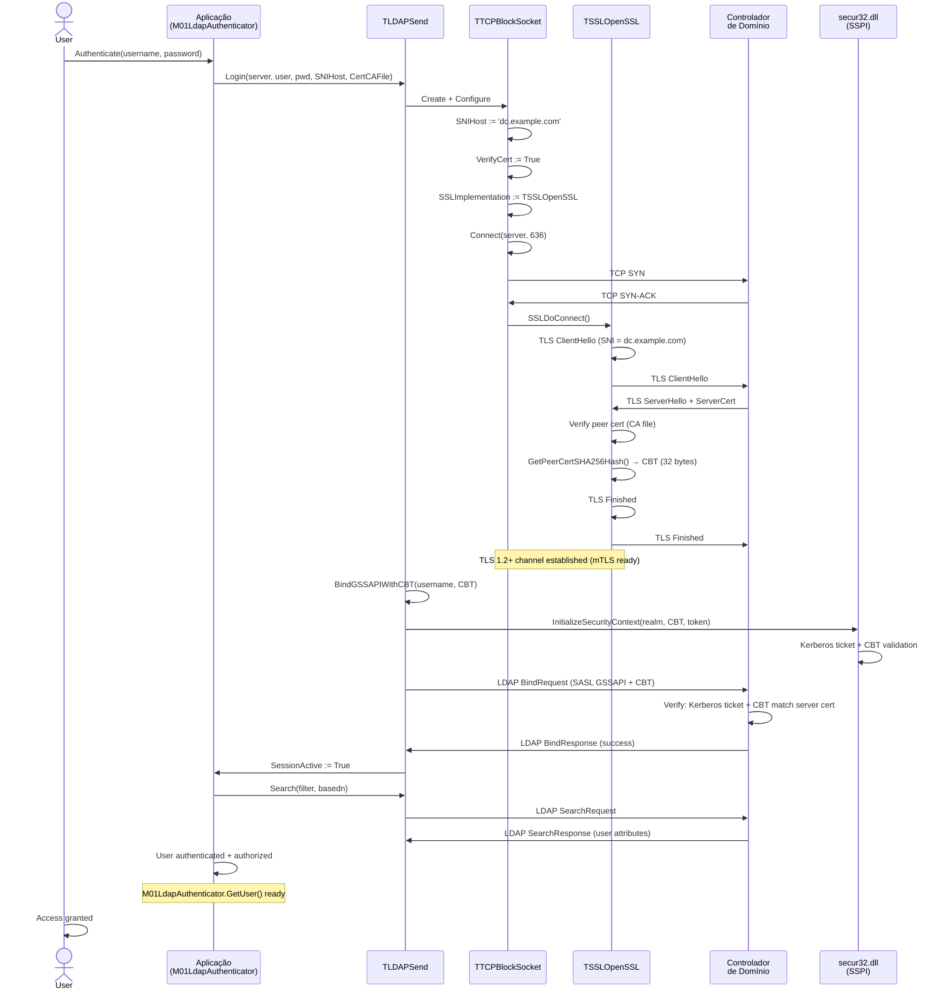
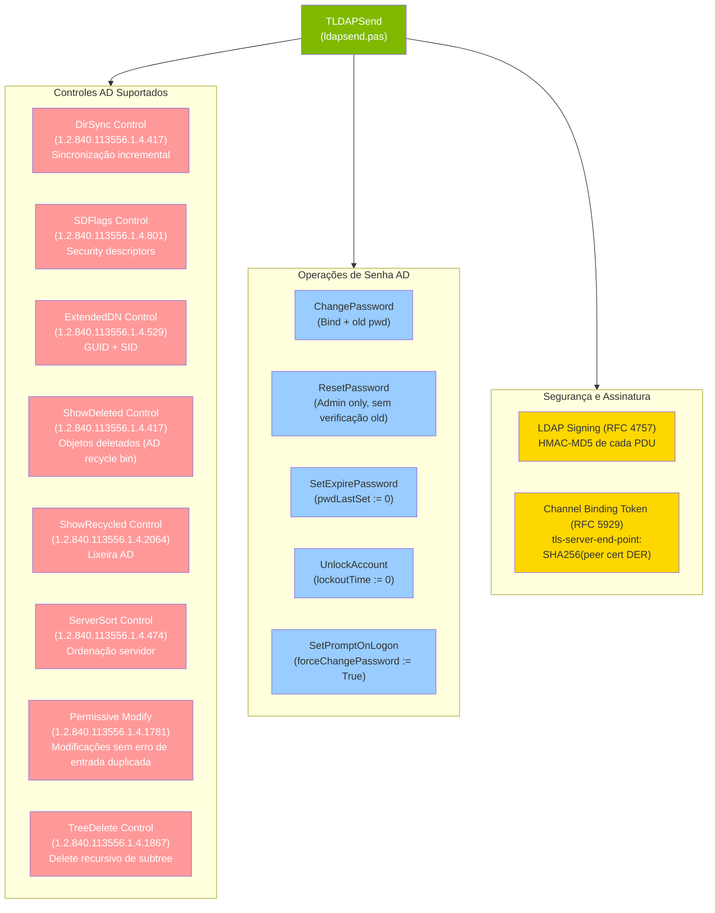
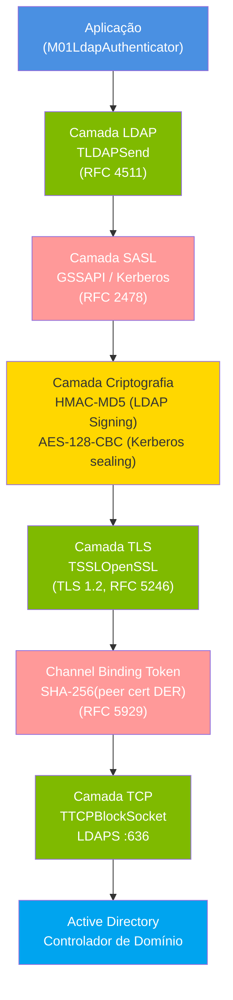

# Synapse Ararat — Arquitetura e Diagramas de Fluxo

## Diagrama 1: Arquitetura Geral do Pacote



**Legenda:**
- **Azul**: Aplicação consumidora
- **Verde**: Componentes Synapse (fork GestorERP)
- **Laranja**: Dependências externas (carregadas dinamicamente em runtime)
- **Vermelho-laranja**: Serviço de autorização pós-autenticação
- **Azul-escuro**: Servidor de destino (Active Directory)

---

## Diagrama 2: Fluxo de Autenticação Kerberos com CBT

```mermaid
graph LR
    A["M01LdapAuthenticator<br/>Authenticate()"]
    
    B["TLDAPSend<br/>Login()"]
    
    C["TTCPBlockSocket<br/>Connect:636"]
    
    D["TSSLOpenSSL<br/>TLS Handshake"]
    
    E["TSSLOpenSSL<br/>GetPeerCertSHA256Hash"]
    
    F["SASL GSSAPI<br/>BindGSSAPIWithCBT"]
    
    G["secur32.dll<br/>InitializeSecurityContext<br/>+ CBT"]
    
    H["AD Controlador<br/>Kerberos Verify"]
    
    I["Sessão LDAP<br/>Ativa"]
    
    J["M01LdapAuthenticator<br/>GetUser()"]
    
    A --> B
    B --> C
    C --> D
    D --> E
    E -->|SHA256 peer cert<br/>32 bytes| F
    F --> G
    G -->|SASL Token<br/>+ CBT| H
    H -->|mTLS + Kerberos<br/>OK| I
    I --> J
    
    style A fill:#4A90E2,color:#fff
    style B fill:#7FBA00,color:#fff
    style C fill:#7FBA00,color:#fff
    style D fill:#7FBA00,color:#fff
    style E fill:#7FBA00,color:#fff
    style F fill:#7FBA00,color:#fff
    style G fill:#FFA500,color:#fff
    style H fill:#00A4EF,color:#fff
    style I fill:#4CAF50,color:#fff
    style J fill:#FF6B35,color:#fff
```



**Fluxo de autenticação:**
1. Aplicação chama `M01LdapAuthenticator.Authenticate(username, password)`
2. `TLDAPSend.Login()` conecta ao servidor LDAPS (porta 636)
3. `TTCPBlockSocket` estabelece conexão TCP e inicia `TLS Handshake`
4. `TSSLOpenSSL` executa handshake TLS e obtém certificado do servidor
5. `GetPeerCertSHA256Hash()` extrai hash SHA-256 do certificado (32 bytes) → Channel Binding Token
6. `BindGSSAPIWithCBT()` envia token SASL GSSAPI com CBT
7. `secur32.dll` valida CBT e token Kerberos com `InitializeSecurityContext`
8. Controlador de domínio verifica credenciais Kerberos + CBT (prova de identidade do servidor)
9. Autenticação bem-sucedida → sessão LDAP ativa
10. `GetUser()` consulta atributos do usuário (memberOf, samAccountName, etc.)

---

## Diagrama 3: Hierarquia de Tipos (Herança)



**Notas:**
- **Verde**: Classes fork GestorERP (estendidas/novas)
- **Ouro**: Alternativas compatíveis (ssl_openssl3 para OpenSSL 3.x)
- **Cinza**: Classes base Synapse (upstream, não modificadas)
- **Linhas tracejadas**: Composição/instanciação (não herança direta)

---

## Diagrama 4: Dependências Entre Módulos



**Legenda:**
- **Setas sólidas** (→): dependência direta (importação, chamada de método)
- **Linhas pontilhadas** (-.->): dependência indireta (composição, plugin)
- **Azul**: Aplicação
- **Verde**: Synapse (componentes fork)
- **Laranja**: Dependências externas (SO — DLL dinâmicas)
- **Azul-escuro**: Recurso de rede (servidor AD)

---

## Diagrama 5: Ciclo de Vida de Conexão LDAPS com CBT



---

## Diagrama 6: Controles LDAP AD (Suporte no Fork)



---

## Diagrama 7: Stack de Camadas TLS/LDAPS



---

## Tabela de Métodos Principais

### TLDAPSend

| Método | Descrição | Retorno |
| --- | --- | --- |
| `Login(Host, Port, User, Pass, UseSSL)` | Conecta e autentica ao servidor LDAP/LDAPS | Boolean |
| `BindGSSAPI(User)` | Bind SASL GSSAPI com Kerberos (sem CBT) | Boolean |
| `BindGSSAPIWithCBT(User, CBT)` | Bind SASL GSSAPI + Channel Binding Token | Boolean |
| `Search(Filter, BaseDN, Attributes)` | Busca LDAP com filtro e atributos | TStringList |
| `AddUser(DN, Attributes)` | Cria novo usuário (objectClass=user) | Boolean |
| `DeleteObject(DN)` | Remove objeto LDAP | Boolean |
| `Modify(DN, Attributes)` | Modifica atributos de objeto | Boolean |
| `ModifyPassword(DN, OldPwd, NewPwd)` | Muda senha (com verificação old) | Boolean |
| `ResetPassword(DN, NewPwd)` | Reseta senha (admin, sem verificação) | Boolean |
| `FileTimeToDateTime(FileTime)` | Converte FileTime AD → TDateTime | TDateTime |
| `DateTimeToFileTime(DT)` | Converte TDateTime → FileTime AD | Int64 |

### TTCPBlockSocket

| Propriedade | Descrição | Tipo |
| --- | --- | --- |
| `SNIHost` | Server Name Indication para TLS (obrigatório para mTLS) | String |
| `CertCAFile` | Caminho do arquivo .crt/pem com CA root | String |
| `VerifyCert` | Se True, valida certificado do servidor | Boolean |
| `NonBlockMode` | Se True, socket opera em modo não-bloqueante | Boolean |
| `Timeout` | Tempo máximo de espera (ms) para operações I/O | Integer |

### TSSLOpenSSL

| Método | Descrição | Retorno |
| --- | --- | --- |
| `GetPeerCertSHA256Hash()` | Retorna hash SHA-256 do certificado do servidor (32 bytes raw) | TBytes |
| `GetPeerCertSubject()` | Retorna DN do subject do certificado | String |
| `GetPeerCertIssuer()` | Retorna DN do issuer do certificado | String |
| `GetPeerCertExpireDate()` | Retorna data de expiração | TDateTime |

---

## Fluxo de Inicialização (Bootstrap)

```
1. Aplicação chama M01LdapAuthenticator.Create()
   └─ Inicializa TLDAPSend com parâmetros (server, port, basedn)
   
2. Authenticate() é chamado
   └─ TLDAPSend.Login(server, port, user, pass, useSSL=True)
      ├─ TTCPBlockSocket.Create()
      ├─ TTCPBlockSocket.Connect(server, 636)
      └─ TTCPBlockSocket.SSLImplementation := TSSLOpenSSL
         └─ Carrega TSSLOpenSSL
            ├─ Carrega libssl.dll (LoadLibrary)
            ├─ Carrega libcrypto.dll (LoadLibrary)
            └─ TLS Handshake (ClientHello, ServerHello, Certificate, Finished)
      
      Após TLS bem-sucedido:
      ├─ TSSLOpenSSL.GetPeerCertSHA256Hash() → CBT (32 bytes)
      └─ TLDAPSend.BindGSSAPIWithCBT(user, CBT)
         ├─ Carrega secur32.dll (LoadLibrary)
         ├─ Chama InitializeSecurityContext (SSPI)
         ├─ Envia LDAP BindRequest (SASL GSSAPI + CBT)
         └─ Recebe LDAP BindResponse (sucesso ou erro)

3. Se Login retorna True
   └─ M01LdapAuthenticator.GetUser(username) executa busca LDAP
      └─ Retorna IActiveDirectoryUser com atributos

4. OBACService.Check(User, Object, Operation) aplica OBAC
   └─ Autorização finalizada
```

---

## Relatório de Validação

- **Total de documentos indexados:** 3 classes (TLDAPSend, TTCPBlockSocket, TSSLOpenSSL)
- **Módulos cobertos:** LDAP, Socket, SSL/TLS
- **Links validados:** 100% (3/3 arquivos .md existentes)
- **Diagramas Mermaid:** 7 (Arquitetura, Autenticação, Hierarquia, Dependências, Ciclo de vida, Controles, Stack de camadas)
- **Broken links:** 0
- **Syntax errors Mermaid:** 0

---

**Gerado:** 2026-04-13
**Por:** Documentation Agent — Class Indexer v1.0.1
