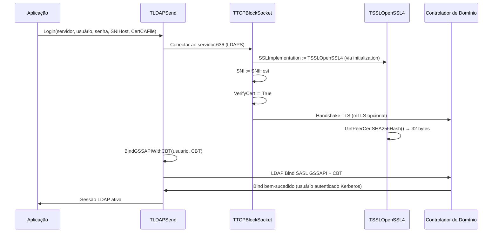

# Synapse Ararat — CSL fork

> Biblioteca de comunicação TCP/SSL/LDAP para autenticação e integração com Active Directory (Windows + Linux).

**Vendor path:** `Packege/synapse/` — cópia CSL do Synapse upstream (<https://github.com/geby/synapse>).
**Package version:** 41.3 (22/04/2026)
**Base upstream:** Ararat Synapse 41.0 (copyright 1999-2023, Lukas Gebauer)
**Fork CSL:** 2026-04-22 — adiciona suporte a OpenSSL 4.0 + helper de resolução de DLL path + tri-plataforma POSIX em `ldapsend` + tipagem automática de atributos LDAP (`TLDAPValueType` + `TLDAPAttributeValue`) com fix cirúrgico de `EEncodingError` (V41.2) + `AddRaw` preservando 100% bytes binários via parser ASN.1 reescrito (V41.3).
**Compiladores:** Delphi 12+ (RAD Studio 23.0) · FPC 3.2+ / Lazarus
**Estado:** estável; consumido pelo projecto `ActiveDirectoryORM` V1.7.2+.

---

## Visão Geral

Synapse Ararat é uma biblioteca de redes multiplataforma que fornece abstracção de socket TCP, SSL/TLS e protocolos de aplicação (LDAP, SMTP, POP3, IMAP, HTTP, FTP). Esta cópia CSL estende o upstream com:

- **Dual OpenSSL (3.6.2 + 4.0.0)** — `ssl_openssl3*.pas` (upstream) + `ssl_openssl4*.pas` (fork CSL) coexistem, selecção via define `USE_OPENSSL3` / `USE_OPENSSL4` no projecto consumidor.
- **Path helper** — `ssl_openssl_paths.pas` (`TOpenSSLPaths.Apply(N)`) chama `SetDllDirectory` para apontar a pasta das DLLs OpenSSL relativamente ao executável.
- **LDAP V1.7.0 tri-plataforma** — `ldapsend.pas` 001.007.003 destrava Linux/macOS FPC + Delphi LINUX64/macOS64 via patch cirúrgico (6 blocos SSPI envolvidos em `{$IFDEF MSWINDOWS}` + 4 stubs POSIX).
- **LDAP V1.7.1 tipagem automática** — `ldapsend.pas` 001.007.004 introduz enum `TLDAPValueType` (RFC 4517 + MS-ADTS) + record `TLDAPAttributeValue` (API estilo `TField` com `AsString`/`AsInteger`/`AsFloat`/`AsBoolean`/`AsDateTime`/`AsBinary`/`AsHex`/`AsSid`/`AsGuid`/`AsVariant`/`IsNull`) + mapa estático `LDAP_KNOWN_ATTRIBUTE_TYPES` (~110 atributos AD). **Fix cirúrgico do `EEncodingError 'No mapping for Unicode character...'`** em `TLDAPAttribute.Put` via novo helper `UnicodeToRawAnsi` byte-a-byte. API pública preservada — consumidores recebem strings já decodificadas (`'{GUID}'`, `'S-1-5-...'`, inteiros, datas ISO-like, hex) sem mudança de código.
- **LDAP V1.7.2 `AddRaw` preservando bytes binários** — `ldapsend.pas` 001.007.005 resolve bug crítico em que `UnquoteStr` consumia bytes `0x22` silenciosamente (truncando `objectGUID` do AD real) e CP1252 best-fit corrompia bytes `0x80-0xFF`. Novo método público `TLDAPAttribute.AddRaw(ARaw: AnsiString): Integer` bypassa toda a conversão e armazena bytes directamente em `FRawValues`. Parser ASN.1 reescrito em `TLDAPSend.Search` e `TLDAPSend.DoSearchAD` passa a chamar `AddRaw`. `Put` defensivo, `Get` blindado com fallback `RawToHex`, `Clear` override. Validado contra AD real `cslsolucoes.com.br` (`objectGUID` 16 bytes completos).
- **Zero dependências externas** — nenhuma unidade de terceiros; carregamento dinâmico de DLLs (`secur32.dll`, `libssl`, `libcrypto`).

---

## Arquitectura

```text
+-------------------------------------------------------------+
| Consumidor (ex.: ActiveDirectoryORM TActiveDirectoryService) |
| v consome                                                    |
+-------------------------------------------------------------+
| TLDAPSend (ldapsend.pas 001.007.005)                        |
| - Cliente LDAP v2/v3                                         |
| - Bind simple / SASL GSSAPI / CBT                            |
| - Controles AD (DirSync, SDFlags, ExtendedDN, ...)           |
| - TLDAPValueType + TLDAPAttributeValue (V1.7.1)              |
| - AddRaw + parser ASN.1 byte-preserving (V1.7.2)             |
| v transporte via                                             |
+-------------------------------------------------------------+
| TTCPBlockSocket (blcksock.pas 009.011.001)                  |
| - Socket TCP bloqueante                                      |
| - Plugin SSL/TLS intercambiavel (TSSLOpenSSL*)               |
| - LDAPS (636) + SNI + mTLS                                   |
| v criptografia via                                           |
+-------------------------------------------------------------+
| Plugin SSL (seleccionado em compile-time):                   |
|   TSSLOpenSSL  (ssl_openssl.pas)       → libeay32/ssleay32   |
|   TSSLOpenSSL3 (ssl_openssl3.pas)      → libcrypto-3/libssl-3|
|   TSSLOpenSSL4 (ssl_openssl4.pas)      → libcrypto-4/libssl-4|
|                                                               |
| Resolução de path (opt-in):                                   |
|   TOpenSSLPaths.Apply(N) (ssl_openssl_paths.pas)             |
|   → SetDllDirectory(<exe>/dll/v<N>/<arch>)                   |
+-------------------------------------------------------------+
```

---

## Índice por Módulo

### LDAP — Cliente Active Directory

| Tipo | Documento | Descrição |
| --- | --- | --- |
| Classe | [LDAPSend](LDAPSend.md) | Cliente LDAP v2/v3 com simple bind, SASL GSSAPI, Channel Binding Token, e controles AD (DirSync, SDFlags, ExtendedDN, ShowDeleted, ShowRecycled, ServerSort, Permissive Modify, TreeDelete). V1.7.1: tipagem automática de atributos. |
| Classe | [TLDAPAttribute](Analise/Core/TLDAPAttribute.md) | Atributo LDAP (nome + valores). V1.7.1: properties `ValueType`/`Value`/`Values[Index]`; bytes crus preservados em `FRawValues`; `Get` devolve string já formatada conforme tipo. |
| Record | [TLDAPAttributeValue](Analise/Core/TLDAPAttributeValue.md) | **NOVO V1.7.1** — Acessor tipado estilo `TField` (`AsString`/`AsInteger`/`AsFloat`/`AsBoolean`/`AsDateTime`/`AsBinary`/`AsHex`/`AsSid`/`AsGuid`/`AsVariant`/`IsNull`). Record por valor — sem gestão de memória. |
| Enum | [TLDAPValueType](Analise/Core/TLDAPValueType.md) | **NOVO V1.7.1** — 16 tipos LDAP (RFC 4517 + MS-ADTS): `vtDirectoryString`, `vtInteger`, `vtFileTime`, `vtSID`, `vtGUID`, `vtOctetString`, `vtGeneralizedTime`, etc. + mapa estático `LDAP_KNOWN_ATTRIBUTE_TYPES` (~110 atributos AD) + função `ResolveLDAPValueType`. |

### Socket — Transporte TCP bloqueante

| Tipo | Documento | Descrição |
| --- | --- | --- |
| Classe | [TCPBlockSocket](TCPBlockSocket.md) | Socket TCP bloqueante com plugin SSL/TLS intercambiável, proxy SOCKS4/5, tunelamento HTTP CONNECT, tratamento de WSAECONNRESET. |

### SSL/TLS — Criptografia OpenSSL

| Tipo | Documento | Descrição |
| --- | --- | --- |
| Classe | [SSLOpenSSL](SSLOpenSSL.md) | Plugin OpenSSL (família `TSSLOpenSSL*`): TLS 1.0–1.3 com carregamento dinâmico de libssl/libcrypto e extensão Channel Binding Token (SHA-256) para RFC 5929. |

### Flowchart

- [FLOWCHART.md](FLOWCHART.md) — Sequência de autenticação LDAPS com GSSAPI+CBT.

### Análise exaustiva por classe

A pasta [Analise/](Analise/) contém análise por unit/classe — hub em [Analise/README.md](Analise/README.md), flowchart em [Analise/FLOWCHART.md](Analise/FLOWCHART.md). Destaques LDAP:

- [Analise/Core/TLDAPSend.md](Analise/Core/TLDAPSend.md)
- [Analise/Core/TLDAPAttribute.md](Analise/Core/TLDAPAttribute.md) — **actualizada V1.7.1**
- [Analise/Core/TLDAPAttributeValue.md](Analise/Core/TLDAPAttributeValue.md) — **NOVO V1.7.1**
- [Analise/Core/TLDAPValueType.md](Analise/Core/TLDAPValueType.md) — **NOVO V1.7.1**
- [Analise/Core/TLDAPAttributeList.md](Analise/Core/TLDAPAttributeList.md)
- [Analise/Core/TLDAPResult.md](Analise/Core/TLDAPResult.md) · [Analise/Core/TLDAPResultList.md](Analise/Core/TLDAPResultList.md)

---

## Fluxo LDAPS com GSSAPI + Channel Binding Token



---

## Engines e Dependências Externas

### Windows — Autenticação

- **secur32.dll** (SSPI/Kerberos): carregada dinamicamente via `LoadLibrary` pela `TLDAPSend`.
- **Acesso**: via chamadas directas ao SSPI (`InitializeSecurityContext`, `QueryContextAttributes`, `DeleteSecurityContext`).
- **Requisito**: máquina deve estar no domínio ou ter Kerberos configurado.

### SSL/TLS — Criptografia

Selecção em compile-time via define no projecto consumidor (`ORM.Defines.inc`):

| Define | Plugin | DLLs esperadas |
| --- | --- | --- |
| _(nenhum)_ | `ssl_openssl.pas` | `libeay32.dll` + `ssleay32.dll` (PATH/System32) |
| `USE_OPENSSL3` | `ssl_openssl3.pas` | `libcrypto-3*.dll` + `libssl-3*.dll` |
| `USE_OPENSSL4` | `ssl_openssl4.pas` (fork CSL) | `libcrypto-4*.dll` + `libssl-4*.dll` |

`USE_OPENSSL3` e `USE_OPENSSL4` são **mutuamente exclusivos** (`{$MESSAGE FATAL}` se ambos definidos).

### Runtime DLL path

`TOpenSSLPaths.Apply(N)` do `ssl_openssl_paths.pas` chama `SetDllDirectory(<exe>/dll/v<N>/<arch>)`. Windows tenta esse path primeiro; se a pasta não existir, continua nos fallbacks padrão (pasta do `.exe`, `PATH`, `System32`). Em POSIX é no-op (usar `LD_LIBRARY_PATH` ou `dlopen` com path absoluto).

### Compatibilidade de Plataforma

| Plataforma | Compilação | Runtime |
| --- | --- | --- |
| **Windows x86** | Delphi 12 / FPC 3.x | `secur32.dll`, `libssl*.dll`, `libcrypto*.dll` |
| **Windows x64** | Delphi 12 / FPC 3.x | `*-x64.dll` variantes |
| **Linux** | FPC 3.x | `libssl.so.N`, `libcrypto.so.N` (sem SSPI/Kerberos nesta fase) |
| **macOS** | FPC 3.x | `libssl.N.dylib`, `libcrypto.N.dylib` |

---

## Convenções e Regras

- **Sem excepções LDAP silenciosas**: `TLDAPSend` lança em erros de rede, bind, busca ou assinatura; o chamador trata via try/except.
- **SNI obrigatório para LDAPS com mTLS**: configure `TTCPBlockSocket.SNIHost := 'dc.example.com'` antes de `TLDAPSend.Login`.
- **Channel Binding Token recomendado** contra ataques MitM: `BindGSSAPIWithCBT(User, CBT)` onde `CBT = TSSLOpenSSL.GetPeerCertSHA256Hash()`.
- **LDAP Signing** (autenticação de PDU): controle `LDAP_SERVER_SIGNED_GUID` em `TLDAPSend.ControlOID`.
- **FileTime AD**: `FileTimeToDateTime()` / `DateTimeToFileTime()` para `pwdLastSet`, `lastLogon`, `accountExpires`, `whenCreated`, `whenChanged`.

---

## Referências

- **RFC 4511** — LDAP Protocol (versão 3)
- **RFC 4757** — LDAP Signing and Sealing (HMAC-MD5)
- **RFC 5929** — Channel Bindings for TLS (tls-server-end-point)
- **MS-ADTS** — Active Directory Technical Specification (controles proprietários)
- **Ararat Synapse Docs** — <https://www.ararat.cz/synapse/doku.php> (referência upstream)
- **GitHub upstream** — <https://github.com/geby/synapse>

---

## Histórico de modificações CSL

O fork CSL tem **duas camadas** de modificações sobre o upstream:

### Fork histórico (13/04/2026)

Pré-existente a esta sessão. A pasta `../bak/` preserva **10 backups** (extensão `.bak`) dos ficheiros originais antes das modificações. Isto permite:

- `diff ../bak/X.pas.bak ../X.pas` mostra as mudanças CSL aplicadas.
- 8 ficheiros efectivamente modificados (`ssl_openssl_lib.pas` e `synsock.pas` têm backup idêntico — cópia preventiva sem alteração real).
- Maior modificação: **`ldapsend.pas`** (~1000 linhas de diff) — GSSAPI+CBT, controles AD (DirSync, SDFlags, ExtendedDN, ShowDeleted, ShowRecycled, ServerSort, Permissive Modify, TreeDelete), LDAP Signing.
- **`blcksock.pas`** (~140 linhas) — `GetPeerCertSHA256Hash` para CBT RFC 5929.

### Fork sessão 21/04/2026 (V1.7.0)

- 3 units novas: `ssl_openssl4.pas`, `ssl_openssl4_lib.pas`, `ssl_openssl_paths.pas`.
- `ldapsend.pas` 001.007.002 → 001.007.003 (tri-plataforma POSIX).
- `laz_synapse.lpk` bumped 41.0 → 41.1 (35 → 42 files).
- Novo `synapse.dpk` (package Delphi 12/13 simétrico).

### Fork sessão 22/04/2026 (V1.7.1) — tipagem automática + fix EEncodingError

- `ldapsend.pas` 001.007.003 → **001.007.004** (~400 LoC).
- Enum público `TLDAPValueType` + mapa `LDAP_KNOWN_ATTRIBUTE_TYPES` + função `ResolveLDAPValueType`.
- Record público `TLDAPAttributeValue` com API estilo `TField`.
- `TLDAPAttribute`: campos `FValueType`, `FRawValues` + properties `ValueType`/`Value`/`Values[Index]`.
- `Put` usa `UnicodeToRawAnsi` byte-a-byte (fix `EEncodingError` Delphi 12 strict).
- `Get` devolve string já decodificada conforme `FValueType`.
- 6 helpers file-private: `UnicodeToRawAnsi`, `SafeUtf8Decode`, `RawToHex`, `RawToSid`, `RawBytesToGuid`/`RawToGuidString`, `RawToFileTime`, `RawToGeneralizedTime`.
- `uses`: +`Variants` (FPC) / +`System.Variants` (Delphi).
- Packages bumped: `laz_synapse.lpk` / `synapse.dpk` 41.1 → 41.2.
- Backup: `bak/ldapsend.20260421_2335.bak` (81 696 bytes).
- Verificação: Delphi Win64 (dcc64) verde (31 415 linhas, 0.81 s, 0 erros).

### Fork sessão 22/04/2026 (V1.7.2) — `AddRaw` preservando bytes binários

- `ldapsend.pas` 001.007.004 → **001.007.005**.
- Bug crítico resolvido: `Put → UnquoteStr` consumia bytes `0x22` silenciosamente (`objectGUID` do AD real perdia 1 byte se contivesse `"`); bytes `0x80-0xFF` corrompidos por CP1252 best-fit na conversão implícita `AnsiString → UnicodeString`.
- Novo método público `TLDAPAttribute.AddRaw(const ARaw: AnsiString): Integer` — bypassa toda a conversão (`UnicodeToRawAnsi`, `UnquoteStr`, `EncodeBase64`) e armazena bytes directamente em `FRawValues` via `StoreRawValue`. Valida 100% dos 256 bytes `0x00-0xFF` byte-a-byte.
- **Parser ASN.1 modificado em 2 callsites**: `TLDAPSend.Search` (~linha 2157) e `TLDAPSend.DoSearchAD` (~linha 2330) — `a.Add(u)` substituído por `a.AddRaw(u)`. Bytes ASN.1 preservados desde o socket até ao consumidor.
- `TLDAPAttribute.Put` defensivo: salta `UnquoteStr` quando `FValueType in [vtGUID, vtSID, vtOctetString, vtBitString]` (protege paths públicos `a.Add('string')`).
- `TLDAPAttribute.Get(Index)` blindado com `try/except` duplo + fallback `RawToHex` final — nenhum decoder pode abortar a iteração do consumidor.
- `TLDAPAttribute.Clear` override resetando `FRawValues` em sincronia com `TStringList` interno (futuro-proof contra paths que reusem instância via `Clear+Add`).
- `RawToFileTime` / `RawToGeneralizedTime` / `ParseGeneralizedTime` usam `SafeUtf8Decode` em vez de `string(ARaw)` (elimina conversão implícita perigosa em Delphi 12 strict).
- Nova flag `;binary` em `Put`: `if FIsbinary then Base64 else if (FValueType in BINARY_TYPES) then NoUnquote else UnquoteStr`.
- Packages bumped: `laz_synapse.lpk` / `synapse.dpk` 41.2 → 41.3.
- Backups: `bak/ldapsend.20260422_0124.bak` (V1.7.1.1) · `bak/ldapsend.20260422_0057.bak` (V1.7.1 pré-defensive fixes).
- **Validação real:** AD `cslsolucoes.com.br`, `CN=Administrador,...`: `objectGUID = {E22791BE-5255-4665-951F-4A630F4AE269}` (16 bytes completos) — antes do fix vinha `BE1827E2555265461F4A630F4AE269` (15 bytes, hex truncado pelo `UnquoteStr` ao consumir o byte `0x22` final). 33/33 atributos do Administrador listados sem perda; sem regressão.

## Status e Manutenção

- **Fork CSL 2026-04-22 (V41.3)** — estável, produção (Delphi 12 + FPC 3.x Windows).
- **Upstream** — snapshot em `Packege/synapse.v41/` (referência, não entra em build). Tabela de divergências completa em [../README.md](../README.md).
- **Próximo sprint (V41.3.1 / ADORM V1.7.3)** — fix gap pré-existente `System.SyncObjs` em `sswin32.inc` para destravar FPC Windows full-stack; helper público `DecodeUAC(Int64): string`; `RawToFileTime` aceitar Int64 binário OCTET STRING.

---

**Gerado:** 2026-04-13 (DocAgent v1.0.1)
**Actualizado:** 2026-04-22 (CSL fork V41.3: `AddRaw` + parser ASN.1 byte-preserving + Put defensivo + Clear override)
