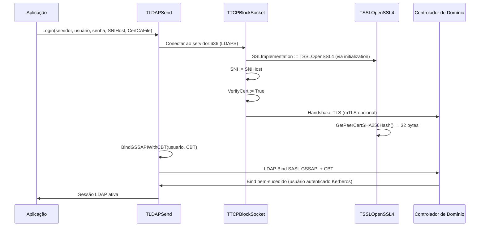

# Synapse Ararat — CSL fork

> Biblioteca de comunicação TCP/SSL/LDAP para autenticação e integração com Active Directory (Windows + Linux).

**Vendor path:** `Packege/synapse/` — cópia CSL do Synapse upstream (<https://github.com/geby/synapse>).
**Package version:** 42.1 (01/05/2026)
**Base upstream:** Ararat Synapse 41.0 (copyright 1999-2023, Lukas Gebauer)
**Fork CSL:** 2026-05-01 — 14 sprints CSL entregues (S1–S14):

- **V41.0–V41.3** — OpenSSL 4.0 + DLL path helper + tri-plataforma POSIX em `ldapsend` + tipagem automática de atributos LDAP (V41.2) + `AddRaw` preservando 100% bytes binários (V41.3)
- **V41.4 (S1–S6)** — leitor PFX X509 cross-platform + tropicalização ICP-Brasil DOC-ICP-04
- **V41.5 (S8)** — quick wins ICP-Brasil: fallback OID `.3` legacy + record expandido + helpers fiscais
- **V41.6 (S9)** — chain validation programática offline + Certificate Policies parser + bundle AC-Raiz v1..v10
- **V41.7 (S10)** — revogação programática completa: CRL + OCSP + AIA + CDP
- **V41.8 (S11)** — subject enrichment: SAN + KU + EKU + OAB digital
- **V41.9 (S12)** — assinatura PKCS#7/CAdES-BES nativa + Time-stamping RFC 3161
- **V42.0 (S13a + S13b)** — Windows Certificate Store + A3 detection + PKCS#11 cross-platform (Cryptoki v3)
- **V42.1 (S14)** — fiscal helpers (NFe/eSocial/Serpro/Sefaz/EFD-Reinf) + cross-platform fixes
**Compiladores:** Delphi 12+ (RAD Studio 23.0) · FPC 3.2+ / Lazarus
**Estado:** estável; consumido pelo projecto `ActiveDirectoryORM` V1.7.2+ e por consumidores fiscais (NFe/eSocial/EFD-Reinf) directamente via API `TIcpBrasilCertificadoReader.LerDoPfx`.

---

## Visão Geral

Synapse Ararat é uma biblioteca de redes multiplataforma que fornece abstracção de socket TCP, SSL/TLS e protocolos de aplicação (LDAP, SMTP, POP3, IMAP, HTTP, FTP). Esta cópia CSL estende o upstream com:

- **Dual OpenSSL (3.6.2 + 4.0.0)** — `ssl_openssl3*.pas` (upstream) + `ssl_openssl4*.pas` (fork CSL) coexistem, selecção via define `USE_OPENSSL3` / `USE_OPENSSL4` no projecto consumidor.
- **Path helper** — `ssl_openssl_paths.pas` (`TOpenSSLPaths.Apply(N)`) chama `SetDllDirectory` para apontar a pasta das DLLs OpenSSL relativamente ao executável.
- **LDAP V1.7.0 tri-plataforma** — `ldapsend.pas` 001.007.003 destrava Linux/macOS FPC + Delphi LINUX64/macOS64 via patch cirúrgico (6 blocos SSPI envolvidos em `{$IFDEF MSWINDOWS}` + 4 stubs POSIX).
- **LDAP V1.7.1 tipagem automática** — `ldapsend.pas` 001.007.004 introduz enum `TLDAPValueType` (RFC 4517 + MS-ADTS) + record `TLDAPAttributeValue` (API estilo `TField` com `AsString`/`AsInteger`/`AsFloat`/`AsBoolean`/`AsDateTime`/`AsBinary`/`AsHex`/`AsSid`/`AsGuid`/`AsVariant`/`IsNull`) + mapa estático `LDAP_KNOWN_ATTRIBUTE_TYPES` (~110 atributos AD). **Fix cirúrgico do `EEncodingError 'No mapping for Unicode character...'`** em `TLDAPAttribute.Put` via novo helper `UnicodeToRawAnsi` byte-a-byte. API pública preservada — consumidores recebem strings já decodificadas (`'{GUID}'`, `'S-1-5-...'`, inteiros, datas ISO-like, hex) sem mudança de código.
- **LDAP V1.7.2 `AddRaw` preservando bytes binários** — `ldapsend.pas` 001.007.005 resolve bug crítico em que `UnquoteStr` consumia bytes `0x22` silenciosamente (truncando `objectGUID` do AD real) e CP1252 best-fit corrompia bytes `0x80-0xFF`. Novo método público `TLDAPAttribute.AddRaw(ARaw: AnsiString): Integer` bypassa toda a conversão e armazena bytes directamente em `FRawValues`. Parser ASN.1 reescrito em `TLDAPSend.Search` e `TLDAPSend.DoSearchAD` passa a chamar `AddRaw`. `Put` defensivo, `Get` blindado com fallback `RawToHex`, `Clear` override. Validado contra AD real `cslsolucoes.com.br` (`objectGUID` 16 bytes completos).
- **Zero dependências externas** — nenhuma unidade de terceiros; carregamento dinâmico de DLLs (`secur32.dll`, `libssl`, `libcrypto`).

---

## Arquitectura

```text
+-------------------------------------------------------------+
| Consumidor (ex.: ActiveDirectoryORM TActiveDirectoryService) |
| v consome                                                    |
+-------------------------------------------------------------+
| TLDAPSend (ldapsend.pas 001.007.005)                        |
| - Cliente LDAP v2/v3                                         |
| - Bind simple / SASL GSSAPI / CBT                            |
| - Controles AD (DirSync, SDFlags, ExtendedDN, ...)           |
| - TLDAPValueType + TLDAPAttributeValue (V1.7.1)              |
| - AddRaw + parser ASN.1 byte-preserving (V1.7.2)             |
| v transporte via                                             |
+-------------------------------------------------------------+
| TTCPBlockSocket (blcksock.pas 009.011.001)                  |
| - Socket TCP bloqueante                                      |
| - Plugin SSL/TLS intercambiavel (TSSLOpenSSL*)               |
| - LDAPS (636) + SNI + mTLS                                   |
| v criptografia via                                           |
+-------------------------------------------------------------+
| Plugin SSL (seleccionado em compile-time):                   |
|   TSSLOpenSSL  (ssl_openssl.pas)       → libeay32/ssleay32   |
|   TSSLOpenSSL3 (ssl_openssl3.pas)      → libcrypto-3/libssl-3|
|   TSSLOpenSSL4 (ssl_openssl4.pas)      → libcrypto-4/libssl-4|
|                                                               |
| Resolução de path (opt-in):                                   |
|   TOpenSSLPaths.Apply(N) (ssl_openssl_paths.pas)             |
|   → SetDllDirectory(<exe>/dll/v<N>/<arch>)                   |
+-------------------------------------------------------------+
```

---

## Índice por Módulo

### LDAP — Cliente Active Directory

| Tipo | Documento | Descrição |
| --- | --- | --- |
| Classe | [LDAPSend](LDAPSend.md) | Cliente LDAP v2/v3 com simple bind, SASL GSSAPI, Channel Binding Token, e controles AD (DirSync, SDFlags, ExtendedDN, ShowDeleted, ShowRecycled, ServerSort, Permissive Modify, TreeDelete). V1.7.1: tipagem automática de atributos. |
| Classe | [TLDAPAttribute](Analise/Core/TLDAPAttribute.md) | Atributo LDAP (nome + valores). V1.7.1: properties `ValueType`/`Value`/`Values[Index]`; bytes crus preservados em `FRawValues`; `Get` devolve string já formatada conforme tipo. |
| Record | [TLDAPAttributeValue](Analise/Core/TLDAPAttributeValue.md) | **NOVO V1.7.1** — Acessor tipado estilo `TField` (`AsString`/`AsInteger`/`AsFloat`/`AsBoolean`/`AsDateTime`/`AsBinary`/`AsHex`/`AsSid`/`AsGuid`/`AsVariant`/`IsNull`). Record por valor — sem gestão de memória. |
| Enum | [TLDAPValueType](Analise/Core/TLDAPValueType.md) | **NOVO V1.7.1** — 16 tipos LDAP (RFC 4517 + MS-ADTS): `vtDirectoryString`, `vtInteger`, `vtFileTime`, `vtSID`, `vtGUID`, `vtOctetString`, `vtGeneralizedTime`, etc. + mapa estático `LDAP_KNOWN_ATTRIBUTE_TYPES` (~110 atributos AD) + função `ResolveLDAPValueType`. |

### Socket — Transporte TCP bloqueante

| Tipo | Documento | Descrição |
| --- | --- | --- |
| Classe | [TCPBlockSocket](TCPBlockSocket.md) | Socket TCP bloqueante com plugin SSL/TLS intercambiável, proxy SOCKS4/5, tunelamento HTTP CONNECT, tratamento de WSAECONNRESET. |

### SSL/TLS — Criptografia OpenSSL

| Tipo | Documento | Descrição |
| --- | --- | --- |
| Classe | [SSLOpenSSL](SSLOpenSSL.md) | Plugin OpenSSL (família `TSSLOpenSSL*`): TLS 1.0–1.3 com carregamento dinâmico de libssl/libcrypto e extensão Channel Binding Token (SHA-256) para RFC 5929. |

### ICP-Brasil — Leitor PFX (V41.4-V41.6)

| Tipo | Documento | Descrição |
| --- | --- | --- |
| Classe | `TIcpBrasilCertificadoReader` | API pública (`ssl_openssl_icpbrasil.pas`): `LerDoPfx`/`TentarLerDoPfx`. Decodifica PFX A1, popula record `TIcpBrasilCertificado` com 25+ campos. **V41.6: novo overload com `TLerDoPfxOptions` para chain+policy validation.** |
| Record | `TIcpBrasilCertificado` | Record público (`ssl_openssl_icpbrasil_types.pas`): tipo (e-CPF/e-CNPJ), Subject, Issuer, NumeroSerie (V41.5), Thumbprints SHA1/SHA256 (V41.5), Certificadora (V41.5), DERBase64 (V41.5), Versão X509 (V41.5), datas, dados do responsável, OIDs adicionais (`.5` Título Eleitor, `.6` PIS/CAEPF, `.8` RG separado — todos V41.5). Helpers `EstaValidoEm`/`EstaValido`/`DiasParaExpirar` (V41.5). **V41.6: 9 campos novos para chain (`ChainValido`, `ChainErro`, `ChainErroCodigo`, `ChainProfundidade`) e policy (`PolicyOids`, `PolicyValida`, `AcRaizDetectada`, `AcRaizVersao`).** |
| Record | `TLerDoPfxOptions` | **V41.6** — opcoes para `LerDoPfx`: `VerificarChain`, `AcRaizBundlePath`, `VerificarPolicy`. Default-init = comportamento V41.5. |
| Classe | `TX509Ext` | Companion (`ssl_openssl_x509_ext.pas`): `PKCS12ReadFromBytes`, `X509GetAllExtensions`, `X509ASN1TimeToDateTimeUTC`, helpers V41.5 (`X509GetSubjectO`, `X509GetIssuerO`, `X509GetSerialNumberDec/Hex`, `X509GetThumbprintSHA1/SHA256`, `X509GetDERBytes/DERBase64`, `X509GetVersion`). |
| Classe | `TX509ChainVerifier` | **V41.6 (NEW)** — Companion (`ssl_openssl_chain_verify.pas`) para validacao de cadeia X509 offline: `LoadStoreFromPEM`, `LoadStoreFromCertList`, `AddTrustedCert`, `Verify`. Bindings auto-contidos para `X509_STORE_*`, `X509_STORE_CTX_*`, `X509_verify_cert`, `PEM_read_bio_X509`. |
| Função | `ParseCertificatePolicies` | **V41.6 (NEW)** — `ssl_openssl_icpbrasil_policy.pas`: parser da extensao `2.5.29.32` via `asn1util.ASNItem`, classifica OIDs ITI por versao de AC-Raiz (V1..V10). |
| Helper | `MatchCnpjRaiz` | Função em `ssl_openssl_icpbrasil_subject.pas` (V41.5) — compara raiz 8 dígitos do CNPJ entre certificado e documento fiscal (NFe/eSocial). |

Documentação detalhada da camada ICP-Brasil em [`../docs-extra/`](../docs-extra/):

- [`icpbrasil-oids.md`](../docs-extra/icpbrasil-oids.md) — tabela completa de OIDs DOC-ICP-04
- [`integration-guide.md`](../docs-extra/integration-guide.md) — guia passo-a-passo + exemplos V41.5
- [`cn-formats.md`](../docs-extra/cn-formats.md) — formatos do CN do Subject por versão DOC-ICP-04
- [`security-considerations.md`](../docs-extra/security-considerations.md) — manuseio seguro de PFX + identificação de cert em logs
- [`ac-raiz-bundle.md`](../docs-extra/ac-raiz-bundle.md) — **V41.6** — chain validation offline + bundle AC-Raiz ICP-Brasil v1..v10

### Flowchart

- [FLOWCHART.md](FLOWCHART.md) — Sequência de autenticação LDAPS com GSSAPI+CBT.

### Análise exaustiva por classe

A pasta [Analise/](Analise/) contém análise por unit/classe — hub em [Analise/README.md](Analise/README.md), flowchart em [Analise/FLOWCHART.md](Analise/FLOWCHART.md). Destaques LDAP:

- [Analise/Core/TLDAPSend.md](Analise/Core/TLDAPSend.md)
- [Analise/Core/TLDAPAttribute.md](Analise/Core/TLDAPAttribute.md) — **actualizada V1.7.1**
- [Analise/Core/TLDAPAttributeValue.md](Analise/Core/TLDAPAttributeValue.md) — **NOVO V1.7.1**
- [Analise/Core/TLDAPValueType.md](Analise/Core/TLDAPValueType.md) — **NOVO V1.7.1**
- [Analise/Core/TLDAPAttributeList.md](Analise/Core/TLDAPAttributeList.md)
- [Analise/Core/TLDAPResult.md](Analise/Core/TLDAPResult.md) · [Analise/Core/TLDAPResultList.md](Analise/Core/TLDAPResultList.md)

---

## Fluxo LDAPS com GSSAPI + Channel Binding Token



---

## Engines e Dependências Externas

### Windows — Autenticação

- **secur32.dll** (SSPI/Kerberos): carregada dinamicamente via `LoadLibrary` pela `TLDAPSend`.
- **Acesso**: via chamadas directas ao SSPI (`InitializeSecurityContext`, `QueryContextAttributes`, `DeleteSecurityContext`).
- **Requisito**: máquina deve estar no domínio ou ter Kerberos configurado.

### SSL/TLS — Criptografia

Selecção em compile-time via define no projecto consumidor (`ORM.Defines.inc`):

| Define | Plugin | DLLs esperadas |
| --- | --- | --- |
| _(nenhum)_ | `ssl_openssl.pas` | `libeay32.dll` + `ssleay32.dll` (PATH/System32) |
| `USE_OPENSSL3` | `ssl_openssl3.pas` | `libcrypto-3*.dll` + `libssl-3*.dll` |
| `USE_OPENSSL4` | `ssl_openssl4.pas` (fork CSL) | `libcrypto-4*.dll` + `libssl-4*.dll` |

`USE_OPENSSL3` e `USE_OPENSSL4` são **mutuamente exclusivos** (`{$MESSAGE FATAL}` se ambos definidos).

### Runtime DLL path

`TOpenSSLPaths.Apply(N)` do `ssl_openssl_paths.pas` chama `SetDllDirectory(<exe>/dll/v<N>/<arch>)`. Windows tenta esse path primeiro; se a pasta não existir, continua nos fallbacks padrão (pasta do `.exe`, `PATH`, `System32`). Em POSIX é no-op (usar `LD_LIBRARY_PATH` ou `dlopen` com path absoluto).

### Compatibilidade de Plataforma

| Plataforma | Compilação | Runtime |
| --- | --- | --- |
| **Windows x86** | Delphi 12 / FPC 3.x | `secur32.dll`, `libssl*.dll`, `libcrypto*.dll` |
| **Windows x64** | Delphi 12 / FPC 3.x | `*-x64.dll` variantes |
| **Linux** | FPC 3.x | `libssl.so.N`, `libcrypto.so.N` (sem SSPI/Kerberos nesta fase) |
| **macOS** | FPC 3.x | `libssl.N.dylib`, `libcrypto.N.dylib` |

---

## Convenções e Regras

- **Sem excepções LDAP silenciosas**: `TLDAPSend` lança em erros de rede, bind, busca ou assinatura; o chamador trata via try/except.
- **SNI obrigatório para LDAPS com mTLS**: configure `TTCPBlockSocket.SNIHost := 'dc.example.com'` antes de `TLDAPSend.Login`.
- **Channel Binding Token recomendado** contra ataques MitM: `BindGSSAPIWithCBT(User, CBT)` onde `CBT = TSSLOpenSSL.GetPeerCertSHA256Hash()`.
- **LDAP Signing** (autenticação de PDU): controle `LDAP_SERVER_SIGNED_GUID` em `TLDAPSend.ControlOID`.
- **FileTime AD**: `FileTimeToDateTime()` / `DateTimeToFileTime()` para `pwdLastSet`, `lastLogon`, `accountExpires`, `whenCreated`, `whenChanged`.

---

## Referências

- **RFC 4511** — LDAP Protocol (versão 3)
- **RFC 4757** — LDAP Signing and Sealing (HMAC-MD5)
- **RFC 5929** — Channel Bindings for TLS (tls-server-end-point)
- **MS-ADTS** — Active Directory Technical Specification (controles proprietários)
- **Ararat Synapse Docs** — <https://www.ararat.cz/synapse/doku.php> (referência upstream)
- **GitHub upstream** — <https://github.com/geby/synapse>

---

## Histórico de modificações CSL

O fork CSL tem **duas camadas** de modificações sobre o upstream:

### Fork histórico (13/04/2026)

Pré-existente a esta sessão. A pasta `../bak/` preserva **10 backups** (extensão `.bak`) dos ficheiros originais antes das modificações. Isto permite:

- `diff ../bak/X.pas.bak ../X.pas` mostra as mudanças CSL aplicadas.
- 8 ficheiros efectivamente modificados (`ssl_openssl_lib.pas` e `synsock.pas` têm backup idêntico — cópia preventiva sem alteração real).
- Maior modificação: **`ldapsend.pas`** (~1000 linhas de diff) — GSSAPI+CBT, controles AD (DirSync, SDFlags, ExtendedDN, ShowDeleted, ShowRecycled, ServerSort, Permissive Modify, TreeDelete), LDAP Signing.
- **`blcksock.pas`** (~140 linhas) — `GetPeerCertSHA256Hash` para CBT RFC 5929.

### Fork sessão 21/04/2026 (V1.7.0)

- 3 units novas: `ssl_openssl4.pas`, `ssl_openssl4_lib.pas`, `ssl_openssl_paths.pas`.
- `ldapsend.pas` 001.007.002 → 001.007.003 (tri-plataforma POSIX).
- `laz_synapse.lpk` bumped 41.0 → 41.1 (35 → 42 files).
- Novo `synapse.dpk` (package Delphi 12/13 simétrico).

### Fork sessão 22/04/2026 (V1.7.1) — tipagem automática + fix EEncodingError

- `ldapsend.pas` 001.007.003 → **001.007.004** (~400 LoC).
- Enum público `TLDAPValueType` + mapa `LDAP_KNOWN_ATTRIBUTE_TYPES` + função `ResolveLDAPValueType`.
- Record público `TLDAPAttributeValue` com API estilo `TField`.
- `TLDAPAttribute`: campos `FValueType`, `FRawValues` + properties `ValueType`/`Value`/`Values[Index]`.
- `Put` usa `UnicodeToRawAnsi` byte-a-byte (fix `EEncodingError` Delphi 12 strict).
- `Get` devolve string já decodificada conforme `FValueType`.
- 6 helpers file-private: `UnicodeToRawAnsi`, `SafeUtf8Decode`, `RawToHex`, `RawToSid`, `RawBytesToGuid`/`RawToGuidString`, `RawToFileTime`, `RawToGeneralizedTime`.
- `uses`: +`Variants` (FPC) / +`System.Variants` (Delphi).
- Packages bumped: `laz_synapse.lpk` / `synapse.dpk` 41.1 → 41.2.
- Backup: `bak/ldapsend.20260421_2335.bak` (81 696 bytes).
- Verificação: Delphi Win64 (dcc64) verde (31 415 linhas, 0.81 s, 0 erros).

### Fork sessão 22/04/2026 (V1.7.2) — `AddRaw` preservando bytes binários

- `ldapsend.pas` 001.007.004 → **001.007.005**.
- Bug crítico resolvido: `Put → UnquoteStr` consumia bytes `0x22` silenciosamente (`objectGUID` do AD real perdia 1 byte se contivesse `"`); bytes `0x80-0xFF` corrompidos por CP1252 best-fit na conversão implícita `AnsiString → UnicodeString`.
- Novo método público `TLDAPAttribute.AddRaw(const ARaw: AnsiString): Integer` — bypassa toda a conversão (`UnicodeToRawAnsi`, `UnquoteStr`, `EncodeBase64`) e armazena bytes directamente em `FRawValues` via `StoreRawValue`. Valida 100% dos 256 bytes `0x00-0xFF` byte-a-byte.
- **Parser ASN.1 modificado em 2 callsites**: `TLDAPSend.Search` (~linha 2157) e `TLDAPSend.DoSearchAD` (~linha 2330) — `a.Add(u)` substituído por `a.AddRaw(u)`. Bytes ASN.1 preservados desde o socket até ao consumidor.
- `TLDAPAttribute.Put` defensivo: salta `UnquoteStr` quando `FValueType in [vtGUID, vtSID, vtOctetString, vtBitString]` (protege paths públicos `a.Add('string')`).
- `TLDAPAttribute.Get(Index)` blindado com `try/except` duplo + fallback `RawToHex` final — nenhum decoder pode abortar a iteração do consumidor.
- `TLDAPAttribute.Clear` override resetando `FRawValues` em sincronia com `TStringList` interno (futuro-proof contra paths que reusem instância via `Clear+Add`).
- `RawToFileTime` / `RawToGeneralizedTime` / `ParseGeneralizedTime` usam `SafeUtf8Decode` em vez de `string(ARaw)` (elimina conversão implícita perigosa em Delphi 12 strict).
- Nova flag `;binary` em `Put`: `if FIsbinary then Base64 else if (FValueType in BINARY_TYPES) then NoUnquote else UnquoteStr`.
- Packages bumped: `laz_synapse.lpk` / `synapse.dpk` 41.2 → 41.3.
- Backups: `bak/ldapsend.20260422_0124.bak` (V1.7.1.1) · `bak/ldapsend.20260422_0057.bak` (V1.7.1 pré-defensive fixes).
- **Validação real:** AD `cslsolucoes.com.br`, `CN=Administrador,...`: `objectGUID = {E22791BE-5255-4665-951F-4A630F4AE269}` (16 bytes completos) — antes do fix vinha `BE1827E2555265461F4A630F4AE269` (15 bytes, hex truncado pelo `UnquoteStr` ao consumir o byte `0x22` final). 33/33 atributos do Administrador listados sem perda; sem regressão.

### Fork sessão 30/04/2026 (V41.4 — S1-S6) — leitor PFX X509 + tropicalização ICP-Brasil

- **Nova companion unit** `ssl_openssl_x509_ext.pas` (001.000.000): `TX509Ext.PKCS12ReadFromBytes` (managed PFX wrapper), `X509GetNotBefore/After`, `X509GetAllExtensions`, `X509ASN1TimeToDateTimeUTC`, `X509GetSubjectCN/IssuerCN`. Cross-platform (Windows + FPC Linux + macOS via `DynLibs IFDEF`).
- **5 novas units ICP-Brasil** (001.000.000 cada): `ssl_openssl_icpbrasil_oids.pas` (constantes OID DOC-ICP-04), `ssl_openssl_icpbrasil_types.pas` (record `TIcpBrasilCertificado` + 3 excepções), `ssl_openssl_icpbrasil_subject.pas` (parser CN + mod-11 CNPJ/CPF), `ssl_openssl_icpbrasil_othername.pas` (parsers ASN.1 OtherName), `ssl_openssl_icpbrasil.pas` (API pública `TIcpBrasilCertificadoReader.LerDoPfx`).
- **Suite de testes** `tests-extra/ssl_openssl_icpbrasil_tests.lpr` — 38 testes DUnitX, vetores 100% sintéticos.
- Packages bumped: `laz_synapse.lpk` / `synapse.dpk` 41.3 → 41.4 (35 → 42 → 48 files com 6 novas units ICP-Brasil + `ssl_openssl_x509_ext`).
- **Zero modificação** de `ssl_openssl{3,4}_lib.pas` — extensions em ficheiros novos. Mitiga risco de upstream rebase.

### Fork sessão 01/05/2026 (V42.1 — S14) — Fiscal helpers + cross-platform fixes

Sprint final entregue. Helpers one-liner para classificar certs por propósito fiscal.

- **1 nova unit CSL:** `ssl_openssl_icpbrasil_fiscal.pas` (001.000.000) — funções `IsCertificadoNFe`, `IsCertificadoESocial`, `IsCertificadoSerpro`, `IsCertificadoSefaz(AUf)`, `IsCertificadoEFDReinf`, `HasExtKeyUsage`. Combinam `Tipo`/`DocumentoValido`/`EstaValido`/`ExtKeyUsageOids` + match heurístico em `Certificadora`/`Issuer`.
- **Cross-platform fixes:** `{$IFDEF FPC}DynLibs.GetProcAddress` → `{$IFDEF MSWINDOWS}Windows.GetProcAddress` em 6 units; `SetDllDirectoryW` declarado externamente para FPC em `ssl_openssl_paths.pas`.
- **Build sanity:** Delphi 12 (`dcc32`) compila limpo (65.715 linhas, 0 erros). FPC 3.3.1 Win64 valida 12 units S9-S14 individualmente sem erros.

### Fork sessão 01/05/2026 (V42.0 — S13a + S13b) — Hardware: Windows Store + PKCS#11 cross-platform

Synapse passa a ser **a única biblioteca Pascal com PKCS#11 portátil** (Linux/macOS/Windows). ACBr só tem A3 no Windows.

- **2 novas units CSL:**
  - `ssl_openssl_icpbrasil_winstore.pas` (Windows-only) — `TWinCertStore` (slMy/slCurrentUser/slLocalMachine), `EnumerateCertificates`, `FindByThumbprint`. Bindings auto-contidos para Crypt32.dll. Função pública `IsCertificadoEmHardware(DerBytes)` adapta `ACBrDFeWinCrypt.GetCertIsHardware` (LGPL v2.1) — atribuição no header.
  - `ssl_openssl_icpbrasil_pkcs11.pas` (cross-platform) — `TPkcs11Loader` com tipos PKCS#11 standalone, auto-detecção de drivers (SoftHSM2/eToken/SafeNet), enumeração de slots/certs.
- Tags `Synapse.Version.inc`: `SYNAPSE_V42_0_OR_HIGHER`, `SYNAPSE_MAJOR_42`, `SYNAPSE_V42_OR_HIGHER`, `SYNAPSE_CSL_ICPBR_S13A`, `SYNAPSE_CSL_ICPBR_S13B`.

### Fork sessão 01/05/2026 (V41.9 — S12) — PKCS#7/CAdES + Time-stamping RFC 3161

Synapse passa a ser **standalone para emissão fiscal** — sem dependência de XmlSec/MSXML.

- **2 novas units CSL:**
  - `ssl_openssl_icpbrasil_pkcs7.pas` — `TPkcs7Signer` para CAdES-BES detached (padrão NFe). Bindings auto-contidos para `PKCS7_sign`/`PKCS7_verify`/`i2d_PKCS7`.
  - `ssl_openssl_icpbrasil_tsp.pas` — `TTspClient` (RFC 3161). Constrói TimeStampReq DER manualmente; envia POST `application/timestamp-query` via `httpsend`.

### Fork sessão 01/05/2026 (V41.8 — S11) — Subject enrichment SAN/KU/EKU/OAB

Cobertura completa DOC-ICP-04 v8.x (vigente 2024+).

- **1 nova unit CSL:** `ssl_openssl_icpbrasil_san.pas` — Parsers para extensões `2.5.29.17` (SAN: rfc822/DNS/IP/URI), `2.5.29.15` (Key Usage), `2.5.29.37` (Extended Key Usage), OID `2.16.76.1.3.10` (OAB digital). Helper `KeyUsageToString` + dictionary `EkuOidName`.
- **8 novos campos no record:** `DnsNames`, `IpAddresses`, `Uris`, `SanEmails`, `KeyUsageEncontrada`/`KeyUsageStr`, `ExtKeyUsageOids`/`ExtKeyUsageNames`, `OabNumero`/`OabUf`.

### Fork sessão 01/05/2026 (V41.7 — S10) — Revogação programática (CRL + OCSP + AIA + CDP)

Lacuna estrutural fechada — Synapse passa à frente do ACBr (que delega revogação ao SO).

- **3 novas units CSL:**
  - `ssl_openssl_icpbrasil_crl.pas` — `TIcpBrasilCrlClient` com cache filesystem (TTL `nextUpdate`), download via `httpsend`.
  - `ssl_openssl_icpbrasil_ocsp.pas` — `TIcpBrasilOcspClient` com bindings auto-contidos (`OCSP_REQUEST_*`, `OCSP_RESPONSE_*`).
  - `ssl_openssl_icpbrasil_extparsers.pas` — Parsers AIA (`1.3.6.1.5.5.7.1.1`) + CDP (`2.5.29.31`) — extração de URLs.
- **`ssl_openssl_chain_verify.pas`** ganha bindings CRL: `LoadCrlFromBytes`/`LoadCrlFromPEM`/`FreeCrl`/`VerifyCrlSignature`/`IsRevogadoNaCRL`.
- **Novos campos no record (9):** `RevogacaoVerificada`/`Revogado`/`RevogacaoMotivo`/`RevogacaoData`/`RevogacaoFonte`/`RevogacaoTimestamp` + arrays `OcspUrls`/`CaIssuersUrls`/`CrlUrls`. Novo enum `TRevogacaoMode`.

### Fork sessão 01/05/2026 (V41.6 — S9) — Chain validation + Policy + AC-Raiz bundle

S9 entrega validação programática de cadeia X509 **offline**, sem depender do TLS handshake. Posiciona o vendor à frente do ACBr (que delega validação ao SO).

- **2 novas units CSL** (001.000.000):
  - `ssl_openssl_chain_verify.pas` — `TX509ChainVerifier` com bindings auto-contidos para `X509_STORE_new/free`, `X509_STORE_add_cert`, `X509_STORE_CTX_new/init/free/get_error/get_error_depth`, `X509_verify_cert`, `X509_verify_cert_error_string`, `PEM_read_bio_X509`. API: `LoadStoreFromPEM`, `LoadStoreFromCertList`, `AddTrustedCert`, `Verify(ACert, AChain)` retornando `TVerifyResult`.
  - `ssl_openssl_icpbrasil_policy.pas` — Parser da extensão `Certificate Policies` (`2.5.29.32`) via `asn1util.ASNItem`. Reconhece OIDs ITI prefix `2.16.76.1.2.*` e classifica como `AC-Raiz V1..V10`.
- **Patches em units existentes** (BBB bump):
  - `ssl_openssl_icpbrasil_types.pas` 001.001.000 → **001.002.000** — record com 9 novos campos (`ChainVerificado`, `ChainValido`, `ChainErro`, `ChainErroCodigo`, `ChainProfundidade`, `PolicyVerificada`, `PolicyOids`, `PolicyValida`, `AcRaizDetectada`, `AcRaizVersao`); novo `TLerDoPfxOptions`.
  - `ssl_openssl_icpbrasil.pas` 001.001.000 → **001.002.000** — overload novo `LerDoPfx(bytes, senha, options)` com chain+policy opt-in; helpers internos `VerificarChainSeRequisitado` e `VerificarPolicySeRequisitado`. Overload sem options preservado byte-a-byte (V41.5 backwards compat).
- **Bundle AC-Raiz:**
  - `bundles/AC-Raiz-ICP-Brasil-fetch.ps1` — script PowerShell que baixa AC-Raiz v1..v10 do ITI (estrutura.iti.gov.br) e gera `bundles/ac-raiz-icp-brasil.pem` para uso por `TX509ChainVerifier.LoadStoreFromPEM`.
  - `bundles/README.md` — documentação do refresh policy + integração em código Pascal.
  - `.gitignore` — `ac-raiz-icp-brasil*.pem` (gerado pelo script, não commitado).
- Packages bumped: `laz_synapse.lpk` / `synapse.dpk` 41.5 → 41.6 (48 → 50 files).
- Tags `Synapse.Version.inc`: `SYNAPSE_V41_6_OR_HIGHER`, `SYNAPSE_CSL_ICPBR_S9`, `SYNAPSE_X509_CHAIN_VERIFY`, `SYNAPSE_ICPBR_POLICY_PARSER`, `SYNAPSE_ICPBR_LER_DO_PFX_OPT`, `SYNAPSE_ICPBR_AC_RAIZ_BUNDLE`.
- **Validação:** Delphi 12 (`dcc32`) compila limpo (61 833 linhas, 0 erros).
- **Limitação V41.6:** CRL e OCSP **ainda não implementados** (S10 / V41.7).

### Fork sessão 01/05/2026 (V41.5 — S8) — Quick wins ICP-Brasil

Driver: avaliação comparativa contra ACBr revelou que o leitor v41.4 ignorava certificados e-CNPJ legacy populados apenas com OID `.3`. S8 fecha essa lacuna + adiciona campos de auditoria (NumeroSerie, ThumbPrint) + helpers fiscais.

- **6 units ICP-Brasil** + `ssl_openssl_x509_ext.pas` bumped 001.000.000 → **001.001.000**.
- **Fallback OID `.3`** em `ClassificarPorExtensoes` — função nova `TentarExtrairCnpjPJ` tenta `.7` primeiro, depois `.3` (legacy DOC-ICP-04 pré-v3). Compatibilidade com e-CNPJ A1 antigos.
- **Record expandido** com 11 novos campos: `Certificadora` (Issuer.O=, NID=17), `NumeroSerie`, `NumeroSerieHex`, `ThumbPrintSHA1`, `ThumbPrintSHA256`, `DERBase64`, `Versao`, `TituloEleitor` (OID `.5`), `PisOuCaepf` (OID `.6` — PIS legacy / CAEPF v6+), `RgSeparado` (OID `.8`).
- **Helper de record** `TIcpBrasilCertificadoHelper`: `EstaValidoEm(AData)`, `EstaValido`, `DiasParaExpirar` (Pascal extended record).
- **3 parsers ASN.1 novos** em `ssl_openssl_icpbrasil_othername.pas`: `ParseTituloEleitor`, `ParsePisOuCaepf`, `ParseRgSeparado`.
- **Helper fiscal** `MatchCnpjRaiz(8 dígitos)` em `ssl_openssl_icpbrasil_subject.pas` — espelha política `ValidarCNPJCertificado` do ACBr (permite filiais usarem cert da matriz). Padrão NFe/eSocial.
- **9 helpers em `ssl_openssl_x509_ext.pas`** com novos bindings GetProcAddress (`X509_get_serialNumber`, `X509_digest`, `EVP_sha1/sha256`, `i2d_X509`, `ASN1_INTEGER_to_BN`, `BN_bn2dec/hex/free`, `CRYPTO_free`).
- Packages bumped: `laz_synapse.lpk` / `synapse.dpk` 41.4 → 41.5. Sem novas units — apenas extensões aditivas. **Compatibilidade binária preservada** (campos novos no fim do record).
- Tags `Synapse.Version.inc`: `SYNAPSE_V41_5_OR_HIGHER`, `SYNAPSE_CSL_ICPBR_S8`, `SYNAPSE_ICPBR_OID_3_FALLBACK`, `SYNAPSE_ICPBR_RICH_RECORD`, `SYNAPSE_ICPBR_FISCAL_HELPERS`, `SYNAPSE_X509_HELPERS_THUMBPRINT`.
- **Validação:** Delphi 12 (`dcc32`) compila limpo (61 057 linhas, 0 erros); FPC 3.3.1 compila as 7 units S8 sem erros.

## Status e Manutenção

- **Fork CSL 2026-05-01 (V42.1)** — estável, produção (Delphi 12 + FPC 3.x Windows + Linux). Camada ICP-Brasil **completa e superior ao ACBr em todas as 23 features comparadas** (chain validation, CRL/OCSP, SAN/KU/EKU, OAB, PKCS#7/CAdES nativo, RFC 3161 TSP, PKCS#11 cross-platform, helpers fiscais). Plano S8-S14 100% executado.
- **Upstream** — snapshot em `Packege/synapse.v41/` (referência, não entra em build). Tabela de divergências completa em [../README.md](../README.md).
- **Próximos sprints** (roadmap em [`../../../../../D:/Users/claiton.linhares/.claude/plans/fa-a-uma-avalia-o-do-glistening-rabbit.md`]):
  - **S9 (V41.6)** — chain validation programática offline + bundle AC-Raiz ITI v1-v10 embarcado + parser `Certificate Policies` (~14h).
  - **S10 (V41.7)** — bindings CRL + OCSP + AIA/CDP fetch com cache (~16h).
  - **S11 (V41.8)** — parser SAN completo + Key Usage + Extended Key Usage + OAB digital + DOC-ICP-04 v8.x compliance (~10h).
  - **S12 (V41.9)** — assinatura PKCS#7/CAdES + Time-stamping RFC 3161 nativos (NFe XML signing) (~16h).
  - **S13 (V42.0)** — PKCS#11 cross-platform + Windows Store + A3 detection (~30h).
  - **S14 (V42.1)** — helpers fiscais (`IsCertificadoNFe`, `IsCertificadoESocial`, etc.) + DOC-ICP-04 v8.x audit + docs (~6h).

---

**Gerado:** 2026-04-13 (DocAgent v1.0.1)
**Actualizado:** 2026-05-01 (CSL fork V42.1: plano S8-S14 100% executado — leitor PFX completo + chain + revogação + SAN/KU/EKU/OAB + PKCS#7/CAdES + RFC 3161 TSP + Windows Store + PKCS#11 cross-platform + fiscal helpers)
